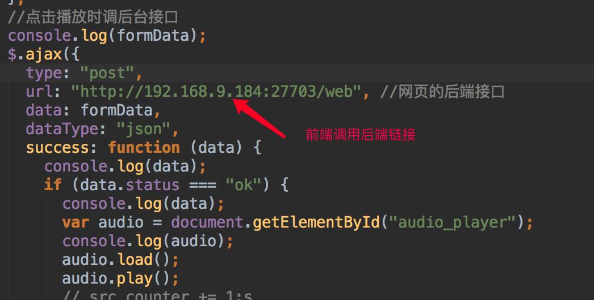

# 语音翻译机 Voice Translator
## 1. 安装环境
### 研发环境
- python 3.*

### 安装环境命令
- 推荐在任何研发环境中均使用虚拟环境，如在201研发服务器上的py36虚拟环境

```
pip install -r requirements.txt # TODO：还有很多依赖包missing
```

## 2. 运行
```
pip install -r requirements.txt
```
注意：当pydudio安装不上的时候可以用conda.
命令行：conda install pyaudio

## 2、运行
- 注明：运行命令已写成脚本，在script文件中的run_api.sh

# 2、运行
- 注明：我将运行命令写成了一个脚本，在script文件中的run_api.sh的文件中

```
cd script  #进入脚本文件
vim run_api.sh # 修改自己的命令 python manage.py runserver 0.0.0.0:端口号;
./run_api.sh  # 运行脚本
```
- 修改成自己的脚本后运行。要修改成自己的命令
- run_api.sh 文件要加运行权限。命令：chmod 777 ./run_api.sh

## 3. 主要文件说明
- static 文件中存放的是前端展示的代码，例如ai-voice-web,以及生成输出的文件，例如output.
- demo_app 是Django的子程序。设置路由为demo_app/urls.py;编写路由视图为demo_app/.py;
- django_demo 是Django的主程序，主要的设置主要在这里。django_demo/settings.py
- model 存放调用模型的代码
- script 存放运行程序的脚本
- utlis是你的工程代码文件存放处。
- uwisigi部署解决Django的多并发问题的服务器
- logs运行日志

## 4. 需要注意的点：
- 1、在/django_demo/settings.py 中需要写入你的链接：

```
# CORS
CORS_ORIGIN_WHITELIST = (
    '127.0.0.1:27703',
    'localhost:27703',
    '192.168.9.184:27703', # 你的ip以及端口
)
```

## 5. Postman测试接口举例：
- 假设Django Server已在localhost中启动
- 假设我们有如下翻译服务可供调用 http://localhost:27703/translate 
- 具体请看 demo_app/views.py视图中的参数设置
- 必填参数列表
- language 必填参数 "zh" or "en"
- audioFile 必填参数 mp3音频文件

## 6. 举例
- 多人协作以完成特定Django后台服务（如语音翻译机器人，语音QA机器人）
- Step1. 功能函数需写在utlis/translate.py中，方便调用。例如：

```
global port
port=27703
file_name = '/Users/ccs/Desktop/DjangoDemoTangdong/static/output/translate_output/'
nowTime = datetime.now().strftime('%Y-%m-%d%&&%H:%M:%S')  # 现在
save_file = file_name + "(" + nowTime + ")" + '.mp3'
print("文本保存", save_file)
def VoiceSynthesizer(text,speedVal,tonesVal,volumeVal,role):
    options = {}  # setting
    text = str(text)
    options['spd'] = str(speedVal)    # 语速，取值0-9，默认为5中语速
    options['pit'] = str(tonesVal)    # 音调，取值0-9，默认为5中语调
    options['vol'] = str(volumeVal)   # 音量，取值0-15，默认为5中音量
    options['per'] = str(role)    # 发音人选择, 0为女声，1为男声， 3为情感合成-度逍遥，4为情感合成-度丫丫，默认为普通女
    result = client.synthesis(text, lang='zh', ctp=1, options=options)
    try:
        if not isinstance(save_file, dict):
            with open(save_file, 'wb') as f:
                f.write(result)
                # 获取本机电脑名
                myname = socket.getfqdn(socket.gethostname())
                # 获取本机ip
                myaddr = socket.gethostbyname(myname)
                print("port:",port)
                file_url = "http://"+myaddr+":"+str(port)+"/static/output/translate_output/" + "(" + nowTime + ")" + '.mp3'
                print("file_url", file_url)
            return file_url
    except Exception as e:
        print(e)
        return ('{"status": "没有生成音频文件"}')
```

- Step2. 在/demo_app/views.py中的class TranslateView(View)视图中写入自己的实现逻辑。注明：调用translate.py中的函数。举例：

```
from translate import VoiceSynthesizer
       ##语音合成部分###
        text = "你好！这是翻译机测试功能"  # 翻译过后传入的结果
        speedVal = 5  # 默认
        tonesVal = 5  # 默认
        volumeVal = 5  # 默认
        role = 0  # 默认
        # start3 = datetime.now()
        start3=datetime.datetime.now()
        file_url=VoiceSynthesizer(text, speedVal, tonesVal, volumeVal, role)
        print("返回的结果：",file_url)
        print("返回的类型",type(file_url))
        start4=datetime.datetime.now()
        print(start4 - start3)
        if file_url.strip() == '':
           status="the audio file is null"
        else:
           status = "ok"

        data = [{"file_url":file_url}]
        return HttpResponse(json.dumps({
                "status": status,
                "data":data,
            }))
```

## 7、后续开发补充说明
- TODO: 此部分待整理
- 1、每个人可以将自己要暂时的前端代码文件放入/static中，前端代码调用后端代码姐可以了，实现前后端分离

- 解决并发思路
- 前端每次请求链接加上不同的后缀
    ```
    http://192.168.9.184:27703/static/output/web_output/2019-06-14_10h22m34s.mp3?xxx=0 #第一次请求
     
    http://192.168.9.184:27703/static/output/web_output/2019-06-14_10h22m34s.mp3?xxx=0 #第二次请求
    ```
- 每次生成的文件名加上时间戳，为不一样的文件